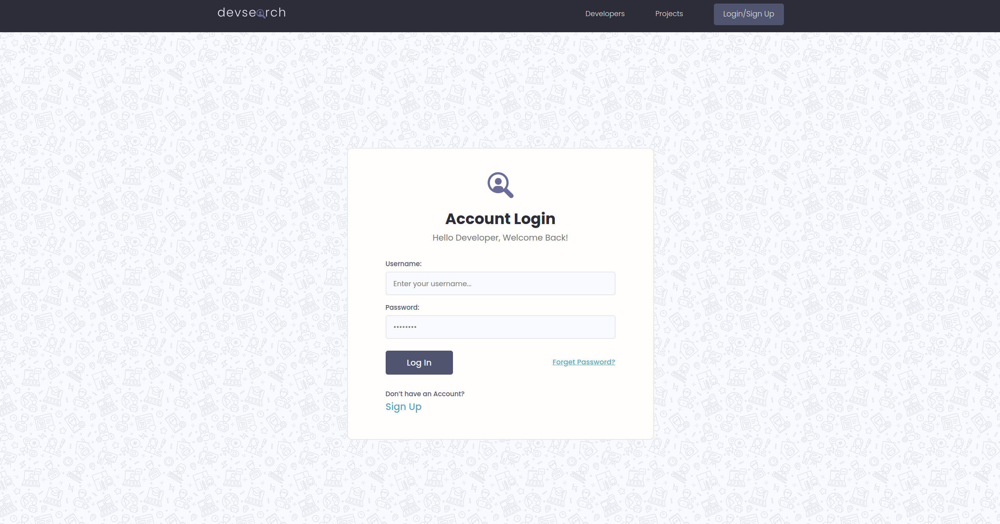
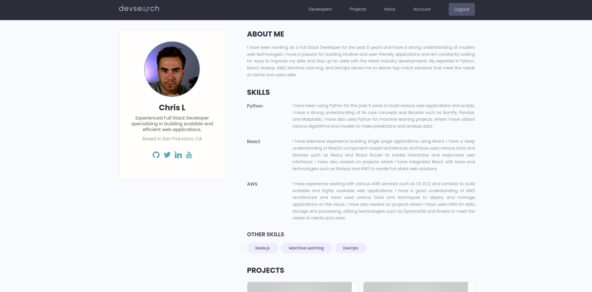
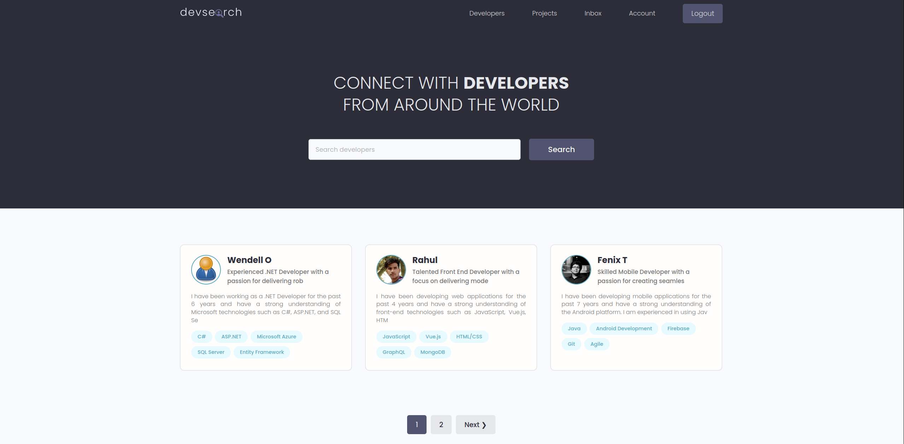
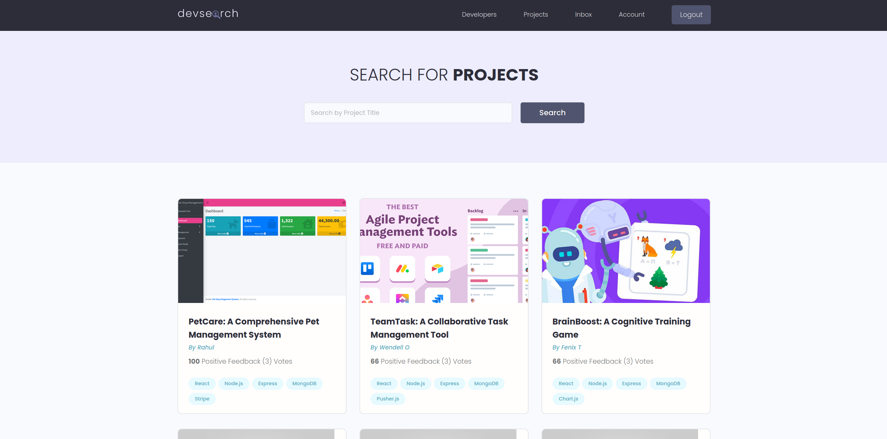

# DevSearch
DevSearch is a social media platform specifically designed for software developers. It functions like a LinkedIn for developers where users can create profiles to showcase their skills, experience, and projects. Developers can connect with one another, collaborate on projects, and discover job opportunities. The platform also features features such as a searchable database of skills and technologies, personalized job recommendations, and the ability to search for and connect with other developers based on their expertise and experience.

## Features
- Profile creation: Ability for developers to create a profile showcasing their skills, experience, and projects.
- Messaging: Direct messaging between users to collaborate on projects or discuss potential job opportunities.
- Project creation: Create and manage projects and invite other developers to collaborate.
- Upvoting/Downvoting: Ability for users to vote on the quality of projects and provide feedback.
- Reviews: Write and receive reviews from other developers, building a reputation and credibility within the community.
- Skill and technology search: Search for other developers based on their skills and technologies.
- Project discovery: Discover new projects and find developers to collaborate with.

## Installation
- 1 - clone repo https://github.com/Csluu/DevSearch.git
- 2 - Create a vritual environment and activate
    - pip install virtualenv
    - virtualenv envname
    - envname\scripts\activate
- 3 - cd into project "cd DevSearch"
- 4 - pip install -r requirements.txt
- 5 - python manage.py runserver

## Usage
**Login / Create Account**
- Enter your login credentials if you already have an account

**Profiles**
- Edit your profile and create projects in the Account Tab

**Developers**
- Search other users in the Developers Tab

**Projects**
- Search for other user generated projects in the Projects Tab

**Inbox**
- Check received messages in the Inbox Tab

## Insights and Takeaways
- 1 - PostgreSQL Integration: I gained hands-on experience with integrating and using PostgreSQL as the database management system for DevSearch. This provided a deeper understanding of the power and versatility of this tool in web development.
- 2 - API Development: I reinforced my knowledge of building APIs with Postman, a powerful API development and testing tool. The process of developing the API for DevSearch highlighted the importance of API design and how it can greatly impact the functionality of an application.
- 3 - Django and Python Reinforcement: The DevSearch project provided an opportunity to reinforce my knowledge of Django and Python. I learned how to effectively utilize these technologies to build a robust and scalable web application.
- 4 - Pagination: I gained an understanding of the importance of pagination in web development, particularly when it comes to handling large amounts of data. I learned how to implement pagination in Django to ensure efficient loading and display of data on the DevSearch platform.
- 5 - Password Resets: I gained experience with setting up password reset functionality for DevSearch, which is a crucial aspect of user management and security. This involved utilizing Django's built-in authentication views and templates, as well as creating custom views to handle password reset requests.
- 6 - Email Configuration: I learned how to set up email functionality for DevSearch, which involved configuring the email settings, creating email templates, and integrating the email functionality into the application. This was a valuable learning experience that will be useful in future web development projects.

Conclusion

The development of DevSearch provided a wealth of knowledge and experience in various aspects of web development. From database management to API development and email functionality, I gained hands-on experience with a variety of tools and technologies that will be useful in future projects.

